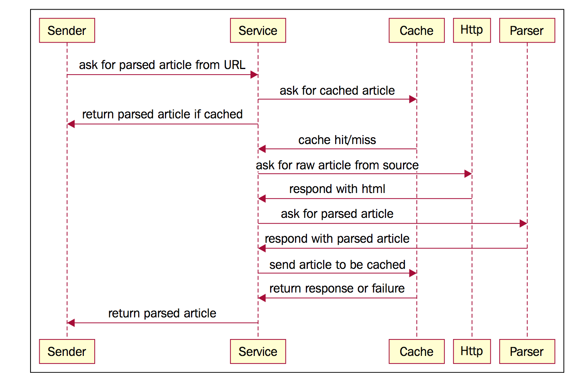

# Ask

ask 模式生成一个 `Future`，表示 `Actor` 返回的响应，ask 模式常用于 `ActorSystem` **外部普通对象** 与 `Actor` 对象通信。

`ActorA` 使用 ask 对 `ActorB` 发起请求时，Akka 会在 `ActorSystem` 中创建一个 **临时 `Actor`**，在 `ActorB` 中执行 `sender()` 获取的其实就是 **临时 `Actor`**，当 `ActorB` 接收到请求，处理完成并响应时，**临时 `Actor`** 会完成 ask 生成的 `Future`。

ask 模式必须设置 **超时参数**，Scala 中使用 `implicit val` 隐式传入，非常简洁：

```Scala
import scala.concurrent.duration._
import akka.pattern.ask
import akka.util.Timeout

implicit val timeout = Timeout(1 second)

val future = actorRef ? "message"
```

## 使用 ask 进行设计

通过 **消息传递** 可以协调多个 `Actor` 之间的行为，若有如下文章解析业务:

1. 使用 `CacheActor` 检查该 url 指定文章是否被缓存；
2. 若未命中缓存，则请求 `HttpClientActor` 下载该 url 的 html 格式文章，然后请求 `ArticleParserActor` 解析 html，返回纯文本；
3. 缓存解析结果，并相应用户；

交互图如下：

 

下面使用 ask 模式设计的代码，并非最优，仅作为一个起点：

```Scala
package com.akkademaid

import akka.pattern._
import akka.actor.{Actor, Status}
import akka.util.Timeout
import com.akkademy.messages.{GetRequest, SetRequest}

import scala.concurrent.Future
import scala.util.{Failure, Success}

class AskDemoArticleParser(cacheActorPath: String,
                           httpClientActorPath: String,
                           articleParserActorPath: String,
                           implicit val timeout: Timeout) extends Actor {

  val cacheActor = context.actorSelection(cacheActorPath)
  val httpClientActor = context.actorSelection(httpClientActorPath)
  val articleParserActor = context.actorSelection(articleParserActorPath)

  import scala.concurrent.ExecutionContext.Implicits.global

  override def receive: Receive = {
    case ParseArticle(url)  ⇒ {

      val senderRef = sender()

      val cacheResult = cacheActor ? GetRequest(url)

      /**
        * 1. recoverWith flatMap 很类似
        * 2. 用 recoverWith 和 flatMap 表达业务逻辑
        */
      val result = cacheResult.recoverWith {
        case _: Exception ⇒
          val rawResult = httpClientActor ? url
          rawResult.flatMap {
            case HttpResponse(rawArticle) ⇒ articleParserActor ? ParseHtmlArticle(url, rawArticle)
            case _                        ⇒ Future.failed(new Exception("unknown response"))
          }
      }

      result.onComplete {
        case Success(x: String)      ⇒ println(s"cached result: $x"); senderRef ! x

        /**
          * 1. 缓存 cacheActor ! SetRequest(url, x)
          * 2. 响应 senderRef ! x
          */
        case Success(x: ArticleBody) ⇒ println(s"parsed result: $x"); cacheActor ! SetRequest(url, x.body); senderRef ! x
        case Failure(e)              ⇒ senderRef ! Status.Failure(e)
        case x                       ⇒ println(s"unknown message: $x")
      }

    }
  }
}
```

* 构造函数包含 `CacheActor` `HttpClientActor` 和 `ArticleParserActor` 的路径，这是 **依赖注入**；
* `AskDemoArticleParser` 内部通过 `actorSelection` 查找 `Actor`
* 依赖注入：测试环境 `CacheActor` 是本地的，生产环境 `CacheActor` 是远程的，非常方便；

**注意**：

* 使用 ask 设计非常简单，但有几处要注意的问题；
* 有时 tell 比 ask 更好；

## ask 注意点

### 1. `onComplete` 中的回调函数在另外 `ExecutionContext` 中执行

```Scala
val senderRef = sender()
```

因为 `onComplete` 回调函数在另一个线程中执行，若在其中调用 `sender()` 无法获取 sender Actor，所以在 **主线程** 中将其放到一个变量中。

### 2. ask 必须设置 `Timeout`

使用 ask 必须提供超时时间，例子中 **所有 ask** 使用了 **同一个超时时间**。

确定合适的超时时间 **非常困难**，太高太低都不行，需要分析生产环境的统计数据才能设置好。

嵌套的 ask 超时时间若不一致：

 

即使整个系统正常工作，但若第二个 ask 超过 2 秒后，第一个 ask 就会超时，意想不到吖。

### 3. timeout stacktraces 掩盖异常的真相

每个 ask 都有自己的超时参数，若有多个 ask 调用，则每个 ask 都可能发生超时错误。蛋疼的是，超时异常不是从 `Actor` 本地线程抛出，而是从 Akka 的 **调度器线程** 抛出，因此根本无法判断到底是 **哪个 ask** 抛出的异常。

另外当 `Actor` 抛出 unexpected exception 时，它并不会自动以 `Status.Failure` 作为响应，该错误看起来像超时引起的，但一般另有其因。

**ask 需要 `Future` 响应**，但 Akka 不会自动生成消息响应，也 **不会在发生错误时自动以 `Status.Failure` 响应**，ask 会创建 **临时 `Actor`**，它永远无法自动感知 **另一个 `Actor`** 中发生的异常，如果 receiver `Actor` 发生了异常，那它就不会通知 **临时 `Actor`** 它的计算结果，最后结果是 **临时 `Actor`** 以超时异常完成 `Future`，从而 **掩盖** 了事情的真相！

### 4. ask 性能开销

ask 看似简单，但隐藏额外的性能开销：

1. ask 会创建临时 `Actor`；
2. ask 需要 `Future`；

它们单个开销不大，但高频执行 ask 时开销还是很客观的，如果性能 mastters，则 tell 比 ask 更合适。

### 5. Actor 和 ask 的复杂性

若仅向 `Actor` 发送 ask，且目标 `Actor` **无状态**，则 ask 作用类似 **异步 API**。

`Actor` 还是要封装 **状态** 的，否则与咸鱼何异？