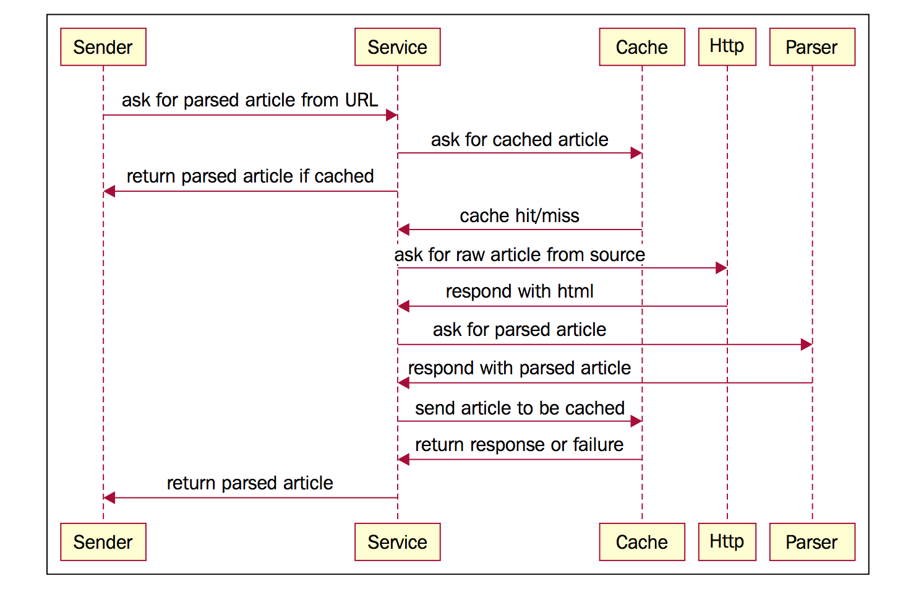
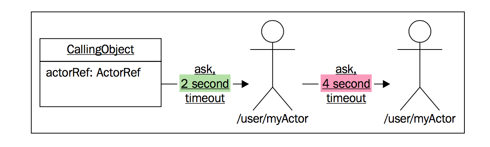

# 消息模式

Akka 有 4 种核心的消息模式，用于在 `Actor` 之间发送消息：

* `ask`
  + 发送消息给 `Actor`，返回表示响应的 `Future`
  + receiver `Actor` 完成任务后，通过完成 `Future` 来完成响应
  + receiver `Actor` 不会向 sender `Actor` 的邮箱发送消息
* `tell`
  + 发送消息给 `Actor`
  + 通过 `sender()` 发送消息回 sender `Actor`
* `forward`
  + 转发消息
  + `sender()` 将获取 original message sender `Actor`
* `pipe`
  + 将 `Future` 结果发送回 `sender()` 或其他 `Actor`

## ask 模式

ask 模式生成一个 `Future`，表示 `Actor` 返回的响应，ask 模式常用于 `ActorSystem` **外部普通对象** 与 `Actor` 对象通信。

`ActorA` 使用 ask 对 `ActorB` 发起请求时，Akka 会在 `ActorSystem` 中创建一个 **临时 `Actor`**，在 `ActorB` 中执行 `sender()` 获取的其实就是 **临时 `Actor`**，当 `ActorB` 接收到请求，处理完成并响应时，**临时 `Actor`** 会完成 ask 生成的 `Future`。

ask 模式必须设置 **超时参数**，Scala 中使用 `implicit val` 隐式传入，非常简洁：

```Scala
import scala.concurrent.duration._
import akka.pattern.ask
import akka.util.Timeout

implicit val timeout = Timeout(1 second)

val future = actorRef ? "message"
```

### 使用 ask 进行设计

通过 **消息传递** 可以协调多个 `Actor` 之间的行为，若有如下文章解析业务:

1. 使用 `CacheActor` 检查该 url 指定文章是否被缓存；
2. 若未命中缓存，则请求 `HttpClientActor` 下载该 url 的 html 格式文章，然后请求 `ArticleParserActor` 解析 html，返回纯文本；
3. 缓存解析结果，并相应用户；

交互图如下：

 

下面使用 ask 模式设计的代码，并非最优，仅作为一个起点：

```Scala
package com.akkademaid

import akka.pattern._
import akka.actor.{Actor, Status}
import akka.util.Timeout
import com.akkademy.messages.{GetRequest, SetRequest}

import scala.concurrent.Future
import scala.util.{Failure, Success}

class AskDemoArticleParser(cacheActorPath: String,
                           httpClientActorPath: String,
                           articleParserActorPath: String,
                           implicit val timeout: Timeout) extends Actor {

  val cacheActor = context.actorSelection(cacheActorPath)
  val httpClientActor = context.actorSelection(httpClientActorPath)
  val articleParserActor = context.actorSelection(articleParserActorPath)

  import scala.concurrent.ExecutionContext.Implicits.global

  override def receive: Receive = {
    case ParseArticle(url)  ⇒ {

      val senderRef = sender()

      val cacheResult = cacheActor ? GetRequest(url)

      /**
        * 1. recoverWith flatMap 很类似
        * 2. 用 recoverWith 和 flatMap 表达业务逻辑
        */
      val result = cacheResult.recoverWith {
        case _: Exception ⇒
          val rawResult = httpClientActor ? url
          rawResult.flatMap {
            case HttpResponse(rawArticle) ⇒ articleParserActor ? ParseHtmlArticle(url, rawArticle)
            case _                        ⇒ Future.failed(new Exception("unknown response"))
          }
      }

      result.onComplete {
        case Success(x: String)      ⇒ println(s"cached result: $x"); senderRef ! x

        /**
          * 1. 缓存 cacheActor ! SetRequest(url, x)
          * 2. 响应 senderRef ! x
          */
        case Success(x: ArticleBody) ⇒ println(s"parsed result: $x"); cacheActor ! SetRequest(url, x.body); senderRef ! x
        case Failure(e)              ⇒ senderRef ! Status.Failure(e)
        case x                       ⇒ println(s"unknown message: $x")
      }

    }
  }
}
```

* 构造函数包含 `CacheActor` `HttpClientActor` 和 `ArticleParserActor` 的路径，这是 **依赖注入**；
* `AskDemoArticleParser` 内部通过 `actorSelection` 查找 `Actor`
* 依赖注入：测试环境 `CacheActor` 是本地的，生产环境 `CacheActor` 是远程的，非常方便；

**注意**：

* 使用 ask 设计非常简单，但有几处要注意的问题；
* 有时 tell 比 ask 更好；

### ask 注意点

#### 1. `onComplete` 中的回调函数在另外 `ExecutionContext` 中执行

```Scala
val senderRef = sender()
```

因为 `onComplete` 回调函数在另一个线程中执行，若在其中调用 `sender()` 无法获取 sender Actor，所以在 **主线程** 中将其放到一个变量中。

#### 2. ask 必须设置 `Timeout`

使用 ask 必须提供超时时间，例子中 **所有 ask** 使用了 **同一个超时时间**。

确定合适的超时时间 **非常困难**，太高太低都不行，需要分析生产环境的统计数据才能设置好。

嵌套的 ask 超时时间若不一致：

 

即使整个系统正常工作，但若第二个 ask 超过 2 秒后，第一个 ask 就会超时，意想不到吖。

#### 3. timeout stacktraces 掩盖异常的真相

每个 ask 都有自己的超时参数，若有多个 ask 调用，则每个 ask 都可能发生超时错误。蛋疼的是，超时异常不是从 `Actor` 本地线程抛出，而是从 Akka 的 **调度器线程** 抛出，因此根本无法判断到底是 **哪个 ask** 抛出的异常。

另外当 `Actor` 抛出 unexpected exception 时，它并不会自动以 `Status.Failure` 作为响应，该错误看起来像超时引起的，但一般另有其因。

**ask 需要 `Future` 响应**，但 Akka 不会自动生成消息响应，也 **不会在发生错误时自动以 `Status.Failure` 响应**，ask 会创建 **临时 `Actor`**，它永远无法自动感知 **另一个 `Actor`** 中发生的异常，如果 receiver `Actor` 发生了异常，那它就不会通知 **临时 `Actor`** 它的计算结果，最后结果是 **临时 `Actor`** 以超时异常完成 `Future`，从而 **掩盖** 了事情的真相！

#### 4. ask 性能开销

ask 看似简单，但隐藏额外的性能开销：

1. ask 会创建临时 `Actor`；
2. ask 需要 `Future`；

它们单个开销不大，但高频执行 ask 时开销还是很客观的，如果性能 mastters，则 tell 比 ask 更合适。

#### 5. Actor 和 ask 的复杂性

若仅向 `Actor` 发送 ask，且目标 `Actor` **无状态**，则 ask 作用类似 **异步 API**。

`Actor` 还是要封装 **状态** 的，否则与咸鱼何异？

## tell

* tell 是最简单的消息模式，但其最佳实现却不易掌握，因此先介绍 ask；
* tell **没有 sender**，因此被称为 fire and forget 消息传递机制；
* 虽然 tell 无 sender，但也能实现 request/response 风格的交互；

tell 是 `ActoreRef`/`ActorSelection` 的方法，tell 定义如下：

```Scala
def !(message: Any)(implicit sender: ActorRef = Actor.noSender): Unit
```

除 message 外，还有一个 `implicit ActorRef` 参数，它是响应地址，有两种情况：

* `Actor` 内部执行 tell，`sender` 自动变成指向自己的 `ActorRef`；
* `Actor` 外部执行 tell，`sender` 为 `Actor.noSender`，即无响应地址；

>若响应地址为 `Actor.noSender`，则用 DeadLetter。

### 使用 tell 进行设计

使用 ask 发起请求，然后组合 `Future` 很符合直觉，但 ask 有这样那样的问题，实际上 tell 比 ask 更好。

函数式程序员 **避免使用状态**，但在 Akka 中，若：

1. 在 `Actor` **存储一些状态**；
2. 创建一些临时 `Actor` 来完成特定任务；

这样会简化设计。

### Handling replies with Tell

receiver `Actor` 中，通过 `sender()` 可以获取 sender `Actor` 的引用，因此很容易对消息做出响应，但在 sender `Actor` 中，根本不知道收到的响应是针对 **哪个消息** 的（ask 通过临时 `Actor` 辨识）。

在 `Actor` 中保存状态，例如保存 `id` 和 context 的 map `Map[id: String, context: Any]`，之后：

1. tell 消息时，将 `id` 与 `message` 一起发送；
2. 响应时，将 `id` 与 response 一起返回；
3. sender `Actor` 根据响应中的 `id` 在 map 中查找 context，即可知道该响应是哪只消息的；


通过保存状态，tell 可以实现类似 ask 的语义，但这种方式似乎开销也很大，但它解决了 ask 的两个重大缺点：

* tell 无超时参数，多个 tell 嵌套时不会发生类似 ask 的问题；
* 避免创建临时 `Actor`，从而可以控制 **超时发生的位置**；

ask 的超时往往不是真正的超时，利用 tell 可以在真正需要超时的地方 **手动超时**。

### Scheduling a Tell Timeout

scheduler 能以固定间隔 **重复发送消息**，它最常见的用法是 **延迟 tell 的执行**，例如某 `Actor` 在 3s 后给自己发送一个 check-for-timeout 消息：

```Scala
context.system.scheduler.scheduleOnce(3 seconds, actor, "timeout")
```

>Tell don't Ask!
>
>tell 优先于 ask，消息应该表示 **命令**，`Actor` 应该是 **状态** + **行为** 的组合，不应该由 **过程调用** 组成。
>
>而 ask 类似过程调用，因此尽量避免 ask 模式。

### Avoiding Ask with an Anonymous Actor

两种方式利用 tell 实现 request/response：

* `Actor` 之间使用 tell 时，通过保存 `Map[Id, Context]` 状态实现；
* `ActorSystem` 外部的普通对象中调用 `tell`，通过手动创建 **临时 `Actor`**；
  + 该方式与 ask 底层实现类似，ask 也是通过创建临时 `Actor` 来接收响应的

下面用 tell 改造前面 ask 的例子，消除了 `Future`：

```Scala
import akka.actor.{Actor, ActorRef}
import akka.util.Timeout
import com.akkademy.messages.GetRequest

import scala.concurrent.duration._

class TellDemoArticleParser(cacheActorPath: String,
                            httpClientActorPath: String,
                            articleParserActorPath: String,
                            implicit val timeout: Timeout) extends Actor {

  val cacheActor = context.actorSelection(cacheActorPath)
  val httpClientActor = context.actorSelection(httpClientActorPath)
  val articleParserActor = context.actorSelection(articleParserActorPath)

  override def receive: Receive = {
    case msg @ ParseArticle(url)  ⇒

      /**
        * 临时 Actor
        */
      val extraActor = buildExtraActor(sender(), url)

      /**
        * 1. 以 tell 方式向 CacheActor 发送 GetRequest 消息，并指定 sender 为 extraActor
        * 2. cacheActor 以 String 响应 extraActor
        */
      cacheActor.tell(GetRequest(url), extraActor)

      /**
        * 1. 以 tell 方式向 HttpClientActor 发送 "test" 消息，并指定 sender 为 extraActor
        * 2. httpClientActor 以 HttpResponse 响应给 extraActor
        */
      httpClientActor.tell("test", extraActor)

      /**
        * 向 extraActor 发送 "timeout" 消息
        */
      context.system.scheduler.scheduleOnce(timeout.duration, extraActor, "timeout")
  }

  private def buildExtraActor(senderRef: ActorRef, url: String): ActorRef = ???
}
```

通过将 `extraActor` 作为参数传递给 `tell`，receiver `Actor` 中可以通过 `sender()` 向 `extraActor` 发送消息来实现响应，一共向 `extraActor` 发送了 3 个消息：

* `cacheActor` 会响应 String 格式的缓存中的文章；
* `httpClientActor` 会响应 `HttpResponse` 格式的原始 HTML 文章；
* `scheduler` 会响应 String 格式的信号；

业务逻辑都在 `buildExtraActor` 中处理：

```Scala
/**
  * 1. timeout 优先级最高
  * 2. body 在 ArticleBody 之前（因为查询缓存、解析是同时进行的，哪个先返回，就用哪个）
  */
private def buildExtraActor(senderRef: ActorRef, url: String): ActorRef =
  context.actorOf(Props(new Actor {
    override def receive: Receive = {
      // 超时，响应 Status.Failure，stop
      case "timeout"              ⇒ senderRef ! Status.Failure(new TimeoutException("timeout!")); context.stop(self)
      // HTML 文章，请求 articleParserActor 解析
      case HttpResponse(body)     ⇒ articleParserActor ! ParseHtmlArticle(url, body)
      // 缓存命中
      case body: String           ⇒ senderRef ! body; context.stop(self)
      // 解析后的文章
      case ArticleBody(url, body) ⇒ cacheActor ! SetRequest(url, body); senderRef ! body; context.stop(self)
      // 缓存未命中
      case _                      ⇒ println("cache missing, ignore it")
    }
  }))
```

* 该临时 `Actor` 声明周期很短暂，只有几秒钟；
* 临时 `Actor` 的响应会发送到 `TellDemoArticleParser` 的 sender `Actor`，而不是 `TellDemoArticleParser` 本身！

创建临时 `Actor` 比 ask 需要更多代码，但消除了 ask 的如下缺点：

1. 每个 ask 都会创建一个 `Future`；
2. 每个 ask 都会创建一个 临时 `Actor`；
3. ask 中的超时异常，往往不是超时引起的，干扰调试；

本例中，只需要创建一个临时 `Actor`，消除了 `Future`，避免 **错误的超时异常** 造成的干扰，便于调试。
