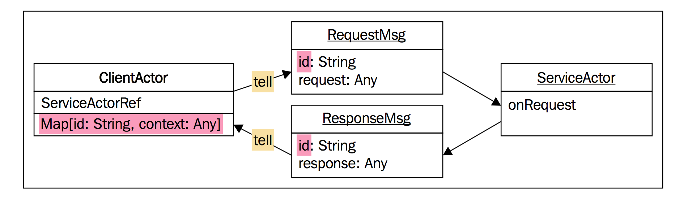

# Tell

* tell 是最简单的消息模式，但其最佳实现却不易掌握，因此先介绍 ask；
* tell **没有 sender**，因此被称为 fire and forget 消息传递机制；
* 虽然 tell 无 sender，但也能实现 request/response 风格的交互；

tell 是 `ActoreRef`/`ActorSelection` 的方法，tell 定义如下：

```Scala
def !(message: Any)(implicit sender: ActorRef = Actor.noSender): Unit
```

除 message 外，还有一个 `implicit ActorRef` 参数，它是响应地址，有两种情况：

* `Actor` 内部执行 tell，`sender` 自动变成指向自己的 `ActorRef`；
* `Actor` 外部执行 tell，`sender` 为 `Actor.noSender`，即无响应地址；

>若响应地址为 `Actor.noSender`，则用 DeadLetter。

## 使用 tell 进行设计

使用 ask 发起请求，然后组合 `Future` 很符合直觉，但 ask 有这样那样的问题，实际上 tell 比 ask 更好。

函数式程序员 **避免使用状态**，但在 Akka 中，若：

1. 在 `Actor` **存储一些状态**；
2. 创建一些临时 `Actor` 来完成特定任务；

这样会简化设计。

## Handling replies with Tell

receiver `Actor` 中，通过 `sender()` 可以获取 sender `Actor` 的引用，因此很容易对消息做出响应，但在 sender `Actor` 中，根本不知道收到的响应是针对 **哪个消息** 的（ask 通过临时 `Actor` 辨识）。

在 `Actor` 中保存状态，例如保存 `id` 和 context 的 map `Map[id: String, context: Any]`，之后：

1. tell 消息时，将 `id` 与 `message` 一起发送；
2. 响应时，将 `id` 与 response 一起返回；
3. sender `Actor` 根据响应中的 `id` 在 map 中查找 context，即可知道该响应是哪只消息的；



通过保存状态，tell 可以实现类似 ask 的语义，但这种方式似乎开销也很大，但它解决了 ask 的两个重大缺点：

* tell 无超时参数，多个 tell 嵌套时不会发生类似 ask 的问题；
* 避免创建临时 `Actor`，从而可以控制 **超时发生的位置**；

ask 的超时往往不是真正的超时，利用 tell 可以在真正需要超时的地方 **手动超时**。

## Scheduling a Tell Timeout

scheduler 能以固定间隔 **重复发送消息**，它最常见的用法是 **延迟 tell 的执行**，例如某 `Actor` 在 3s 后给自己发送一个 check-for-timeout 消息：

```Scala
context.system.scheduler.scheduleOnce(3 seconds, actor, "timeout")
```

>Tell don't Ask!
>
>tell 优先于 ask，消息应该表示 **命令**，`Actor` 应该是 **状态** + **行为** 的组合，不应该由 **过程调用** 组成。
>
>而 ask 类似过程调用，因此尽量避免 ask 模式。

## Avoiding Ask with an Anonymous Actor

两种方式利用 tell 实现 request/response：

* `Actor` 之间使用 tell 时，通过保存 `Map[Id, Context]` 状态实现；
* `ActorSystem` 外部的普通对象中调用 `tell`，通过手动创建 **临时 `Actor`**；
  + 该方式与 ask 底层实现类似，ask 也是通过创建临时 `Actor` 来接收响应的

下面用 tell 改造前面 ask 的例子，消除了 `Future`：

```Scala
import akka.actor.{Actor, ActorRef}
import akka.util.Timeout
import com.akkademy.messages.GetRequest

import scala.concurrent.duration._

class TellDemoArticleParser(cacheActorPath: String,
                            httpClientActorPath: String,
                            articleParserActorPath: String,
                            implicit val timeout: Timeout) extends Actor {

  val cacheActor = context.actorSelection(cacheActorPath)
  val httpClientActor = context.actorSelection(httpClientActorPath)
  val articleParserActor = context.actorSelection(articleParserActorPath)

  override def receive: Receive = {
    case msg @ ParseArticle(url)  ⇒

      /**
        * 临时 Actor
        */
      val extraActor = buildExtraActor(sender(), url)

      /**
        * 1. 以 tell 方式向 CacheActor 发送 GetRequest 消息，并指定 sender 为 extraActor
        * 2. cacheActor 以 String 响应 extraActor
        */
      cacheActor.tell(GetRequest(url), extraActor)

      /**
        * 1. 以 tell 方式向 HttpClientActor 发送 "test" 消息，并指定 sender 为 extraActor
        * 2. httpClientActor 以 HttpResponse 响应给 extraActor
        */
      httpClientActor.tell("test", extraActor)

      /**
        * 向 extraActor 发送 "timeout" 消息
        */
      context.system.scheduler.scheduleOnce(timeout.duration, extraActor, "timeout")
  }

  private def buildExtraActor(senderRef: ActorRef, url: String): ActorRef = ???
}
```

通过将 `extraActor` 作为参数传递给 `tell`，receiver `Actor` 中可以通过 `sender()` 向 `extraActor` 发送消息来实现响应，一共向 `extraActor` 发送了 3 个消息：

* `cacheActor` 会响应 String 格式的缓存中的文章；
* `httpClientActor` 会响应 `HttpResponse` 格式的原始 HTML 文章；
* `scheduler` 会响应 String 格式的信号；

业务逻辑都在 `buildExtraActor` 中处理：

```Scala
/**
  * 1. timeout 优先级最高
  * 2. body 在 ArticleBody 之前（因为查询缓存、解析是同时进行的，哪个先返回，就用哪个）
  */
private def buildExtraActor(senderRef: ActorRef, url: String): ActorRef =
  context.actorOf(Props(new Actor {
    override def receive: Receive = {
      // 超时，响应 Status.Failure，stop
      case "timeout"              ⇒ senderRef ! Status.Failure(new TimeoutException("timeout!")); context.stop(self)
      // HTML 文章，请求 articleParserActor 解析
      case HttpResponse(body)     ⇒ articleParserActor ! ParseHtmlArticle(url, body)
      // 缓存命中
      case body: String           ⇒ senderRef ! body; context.stop(self)
      // 解析后的文章
      case ArticleBody(url, body) ⇒ cacheActor ! SetRequest(url, body); senderRef ! body; context.stop(self)
      // 缓存未命中
      case _                      ⇒ println("cache missing, ignore it")
    }
  }))
```

* 该临时 `Actor` 声明周期很短暂，只有几秒钟；
* 临时 `Actor` 的响应会发送到 `TellDemoArticleParser` 的 sender `Actor`，而不是 `TellDemoArticleParser` 本身！

创建临时 `Actor` 比 ask 需要更多代码，但消除了 ask 的如下缺点：

1. 每个 ask 都会创建一个 `Future`；
2. 每个 ask 都会创建一个 临时 `Actor`；
3. ask 中的超时异常，往往不是超时引起的，干扰调试；

本例中，只需要创建一个临时 `Actor`，消除了 `Future`，避免 **错误的超时异常** 造成的干扰，便于调试。
