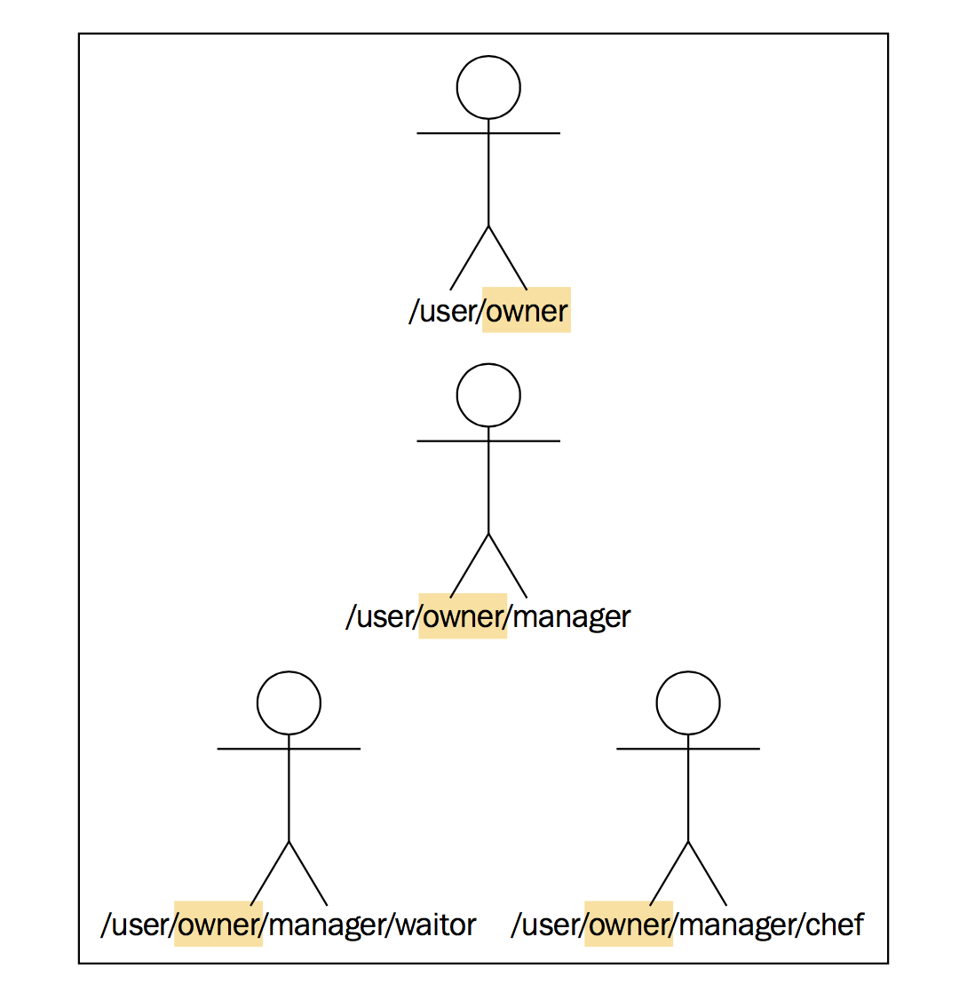

# Failure

8 大误区的第一条就告诉我们：网络不可靠。

除了网络错误，还可能有千千万万其他错误，代码必须能处理这些错误，Akka 本身自带了容错处理机制。

## 1. Isolating failure

分布式应用都应该遵循的错误处理策略为：**隔离错误**。

最著名的例子是船体设计，船体被分成很多互相独立的空间，即使撞到冰山，也只会影响漏水的那些空间，他们被 **隔离** 开了。

### Redundancy

通过 **冗余组件**，消除单点故障，可以保证发生错误时，系统依然可以运行。

## Supervision

Erlang 通过监督机制为 Actor 模型引入 fault tolerance。

监督的核心：

* 将引起错误的组件，与对错误的响应（处理）分开；
  + 父 `Actor` 负责子 `Actor` 错误的处理
* 将可能发生错误的组件，组成便于管理的层次关系；

### 1. Supervision hierarchies

Actor 的监督机制用 Actor 层次结构描述，它与文件系统非常类似：



Actor 基本分类：

* root Actor
  + 位于 Actor 层次结构的最顶层
  + path: /
* 守护 Actor
  + path: /user
  + 所有用 `ActorSystem.actorOf` 创建的 Actor 都位于 /user 下，即 /user/xxx
* 系统 Actor
  + path: /system
* 临时 Actor
  + path: /temp

使用 `context.actorOf` 创建的 Actor 将位于本 Actor 下面，例如 /user/aaa/xxx。

### 2. Supervision strategies

每个负责监督其他 Actor 的 Actor 都可以定义自己的监督策略：

* Resume
  + 不管不顾，继续处理
* Stop
  + 停止 Actor
* Restart
  + 创建新 Actor，替换老 Actor
* Escalate
  + 将错误上升到高一级监督者

### 3. Defining supervisor strategies

Actor 默认监督策略如下：

* **Exception** in a **running** actor: restart()
* **Error** in a **running** actor: escalate()
* **Exception** in an actor during **initialization**: stop()

>Exception 和 Error 区别？

监督者还有一种行为策略：若 `Actor` 被 kill，其监督者会收到 `ActorKilledException`，该场景的策略为 stop()。

通过重写 `Actor.supervisorStrategy` 可以自定义监督策略：

```Scala
class ManagerActor extends Actor {
  override def receive: Receive = ???

  override def supervisorStrategy: SupervisorStrategy =
    OneForOneStrategy() {
      case BrokenPlateException ⇒ Resume
      case DrunkenException     ⇒ Restart
      case TiredException       ⇒ Stop
      case FireError            ⇒ Escalate
      case _                    ⇒ Escalate
    }
}

object ManagerActor {
  case object BrokenPlateException extends Throwable
  case object DrunkenException extends Throwable
  case object FireError extends Error
  case object TiredException extends Throwable
}
```

### 4. Actor lifecycle

`Actor` 声明周期中的钩子方法：

* `preStart`
  + after constructor
* `postStart`
  + before restart
* `preRestart(reason, message)`
  + call `postStop` by default
* `postRestart`
  + call `preStart` by default

`Actor` 生命周期中各个事件、方法的调用顺序如下：


### 5. Messages in restart, stop

发生异常时，会如何处理消息呢？简单说抛出异常的消息会被 **丢弃**，不会被重新发送。

但可以通过监督策略，在消息 **抛出异常之前**，重新发送失败的消息，可以指定 **重试次数**，也可以指定 **重试时间**，只要任意条件达到，就停止重试，抛出异常：

```Scala
override def supervisorStrategy: SupervisorStrategy =
  OneForOneStrategy(maxNrOfRetries = 10) {
    case BrokenPlateException ⇒ Resume
    case DrunkenException     ⇒ Restart
    case TiredException       ⇒ Stop
    case FireError            ⇒ Escalate
    case _                    ⇒ Escalate
  }
```
* 抛出异常前，重试 10 次；

### 6. Terminating or killing an Actor

有多种方式可停止 Actor：

1. `ActorSystem.stop(actorRef)` 和 `ActorContext.stop(actorRef)`
  + 立即停止 Actor
2. 向 Actor 发送 `PoisonPill` 消息
  + 处理完 `PoisonPill` 消息后停止 Actor
3. 先 Actor 发送 `Kill` 消息
  + 抛出 `ActorKilledException`，由其监督者决定怎么做

### 7. Lifecycle monitoring and DeathWatch

Actor 不仅可以监控 **子 Actor**，也可以监控其他任意 Actor：

1. `context.watch(actorRef)` 注册对 `actorRef` 的监控
2. `context.unwatch(actorRef)` 取消监控

注意，仅监控 **是否终止**，被监控 Actor 终止后，监控者将收到 `Terminated(actorRef)` 消息。

### 8. Safely restarting

响应式系统，必须预知并处理错误，一个常见错误为：

* 在 `Actor` 启动运行后才 **初始化其状态**
* 且未处理状态初始化失败的场景

在 `Actor` 启动、运行后，再向 `Actor` 发送初始化状态消息，则初始化过程中可能 **抛出异常**，运行时抛出异常，默认的监督策略会 Restart Actor，而若未考虑错误处理，则 Restart 过程中 **初始化消息可能丢失**。

#### a. 初始化消息

举例说明，假设 `ClientActor` 无初始化参数，当 `ClientActor` 启动后，通过传入 **初始化消息进** 行初始化：

```Scala
val clientActor = system.actorOf(Props[ClientActor])

// 初始化
clientActor ! Connect(host = xx, port = yy)
```

看起来一切合理，`clientActor` 启动运行，处理完 **第一个** 消息后，就能完成初始化，连接到远程数据库。

之后，不断向 `clientActor` 发送消息，某一天，突然网络不可用（非常常见），导致 `clientActor` 抛出异常，根据默认的监督策略，将 Restart clientActor：

1. 执行老 `ClientActor` 的 `preRestart`，并 stop 老 clientActor
  + 此时 **老 Actor 的所有状态会丢失**，包括 host ip 信息
2. 创建新 `ClientActor`，执行其构造器、`postRestart`

新 `ClientActor` 启动运行后，继续处理消息，但是 **初始化消息** 导致的状态丢失了！

#### b. 构造函数初始化

因此更好的做法是将初始化信息作为构造函数的参数，通过 `Props` 传入：

```Scala
class ClientActor(remoteAddress: String) extends Actor {

  private implicit val timeout = Timeout(5 seconds)
  private implicit val system = ActorSystem("LocalSystem")

  private val remoteDb = system.actorSelection(s"akka.tcp://akkademy@$remoteAddress/user/akkademy-db")

  override def receive: Receive = ???

}

object ClientActor {
  def props(address: String): Props = Props(classOf[ClientActor], address)
}
```

使用：

```Scala
val clientActor = system.actorOf(ClientActor props "127.0.0.1:2552")
```

若在运行时发生 Restart，由于初始化信息在构造函数中保存，不受影响。

**问题**：

* 若初始化失败，根据监督策略，监督者将 stop clientActor，该方案依旧不完美！

#### c. Another 初始化消息

为避免 `Actor` 初始化时发生错误，可以在 `preStart()` 中向 `Actor` **本身** 发送一条 Connect 消息：

```Scala
override def preStart = self ! Connect
```

这样一来：

1. 只有 `Actor` 运行时才可能发生错误；
2. 运行时发生错误时会 Restart；

最后效果：`Actor` 不断尝试连接，直到成功。

#### 遗留问题

上面 3 种方式，都有以下问题：

1. 未处理 `Actor` **连接成功之前** 的消息；
2. 若 `Actor` 长时间无法连接，则邮箱可能被 **填满**；
